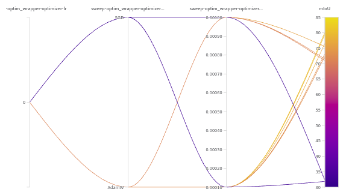

# wandb - sweep in mmsegmentation. (available to other mm-series)

* Weights&Biases - sweep : https://docs.wandb.ai/ref/python/sweep 

mmengine provides WandbVisualizer, so we don't need a special setting for wandb logging or visualization. However, some codes need to be modified to use the sweep function.  


> This code uses mmsegmentation and sample data is from https://www.kaggle.com/datasets/sadhliroomyprime/football-semantic-segmentation . You don't need to download dataset and mmsegmentation if you will apply it directly to your project. 


## change point 
- train.py: add the code that generates sweeps and wandb agent.
- runner.py: add a mount point named 'after_build_visualizer' and change the order of some lines in init func. 
- wandb_sweep_hook.py: wandb init and reset the changed parameters to runner configuration

## How to use
0. wandb login in prompt 

    ```
    wandb login
    ```

1. Put this folder in your mm library folder.

2. Set **sweep configuration** for parameter tuning 
    - This file should be ```.yaml``` format 
    - The rule of naming parameters is following :   
        (1) It must start as 'sweep-'       
        (2) the relations between the key and elements are connected by **dash(-)**.   
        - Example     : If you want to set the learning rate (lr) in config,           

        ```
        optim_wrapper = dict(type='OptimWrapper', 
                    optimizer=dict(type='SGD', lr=0.01, momentum=0.9, weight_decay=0.0005) ,
                    clip_grad=None) 
        ```           

        sweep parameter name is `sweep-optim_wrapper-optimizer-weight_decay`. 

        (3) If element is list, use 'type_' key.              
        - Example    : If you want to set the flip probability in config,       

        ```
            train_pipeline = [
                dict(type='LoadImageFromFile'),
                dict(type='LoadAnnotations'),  
                dict(type='RandomFlip', direction=['horizontal', 'vertical'], prob=[0.25,0.25]), 
                dict(type='PackSegInputs')
            ]
        ```             
        sweep parameter name is ```sweep-train_pipeline-type_RandomFlip-prob```. 

3. Set your configuration for training 
    - Change the paths related to sweep (ex - *custom_imports* or *wandb_sweep*)

4. run train.py 
        
    ```
    python {YOUR_DIRECTORY}/tools/train.py {CONFIG} --{OPTIONS}
    ```

## Issues
This code may have some errors that do not match keywords. You should modify the code to match 'wandb.config' to 'runner.cfg' in the `after_build_visualizer` function of `mmengine/hooks/wandb_sweep_hook.py`. 

